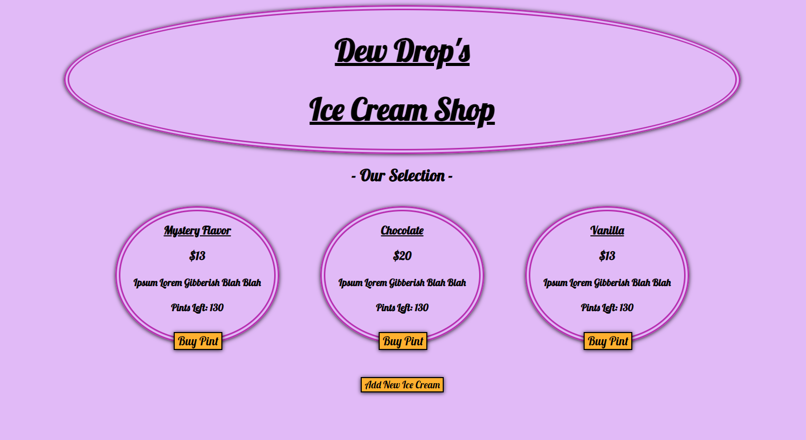
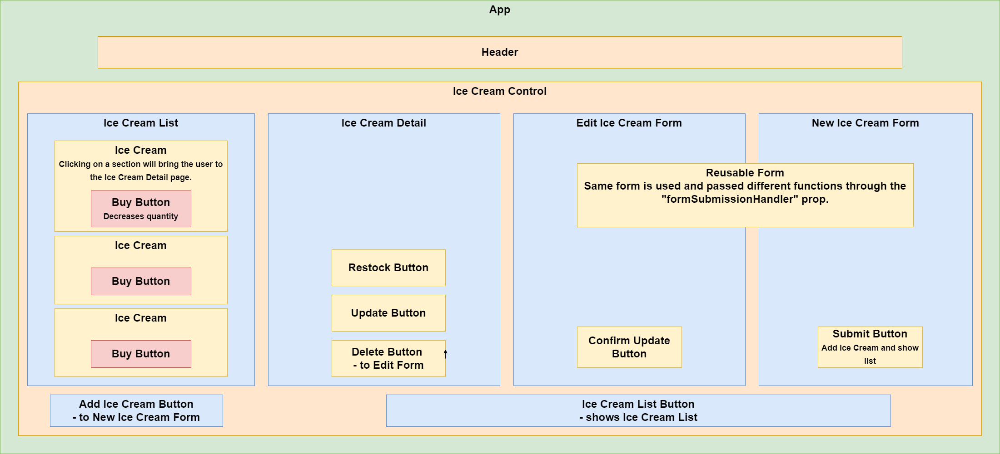

# Dew Drop's Ice Cream Shop

A react app that displays and keeps track of a an ice cream shops inventory.
#### By Aaron Boyd

## Technologies Used

* React
* JavaScript
* NPM
* HTML
* CSS

## Description:
This is a basic demonstration of creating a React application with CRUD functionality. 

A user can Create, Update and Delete a flavor of ice cream with a specific price and description.

If a user does not fill out a section of the form for creating an ice cream flavor, the program will autofill default values.
If a user does not fill out a section of the update form, the program will use the previous value of the ice cream.

# Home Page (Ice Cream List)



# Component Tree



## Setup/Installation Requirements
* _Go to [GitHub](https://github.com/AaronDBoyd/Ice-Cream-Shop-React.git)_
* _Clone git repository to local machine_
```
$ git clone https://github.com/AaronDBoyd/Ice-Cream-Shop-React.git
```
* _Navigate to root folder and open directory in your terminal_

#### Build Environment
* _Install packages:_
```
$ npm install
```

#### Server:
* _Start server:_
```
$ npm start
```

## Known Bugs

* No known bugs.
* If you notice any mistakes or bugs, please email a.boyd91@yahoo.com

## License

[MIT](https://opensource.org/licenses/MIT)
Copyright 2022 (c) Aaron Boyd 